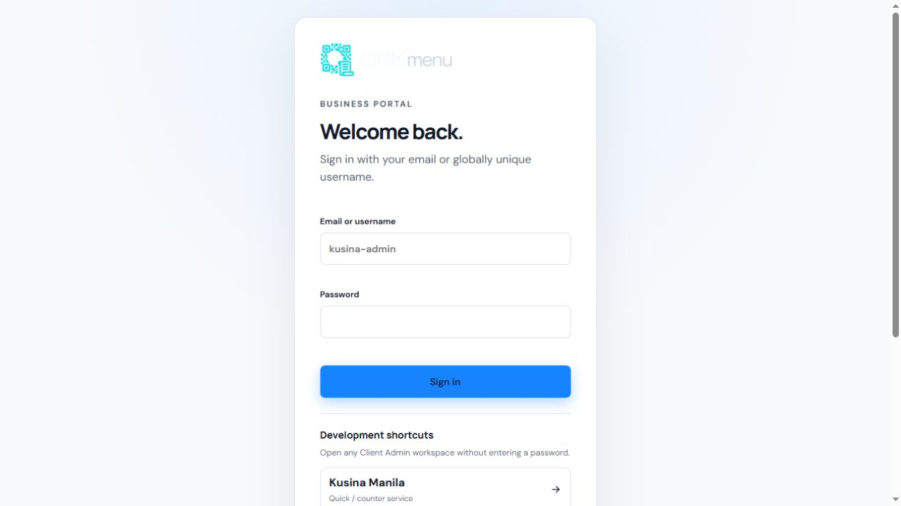
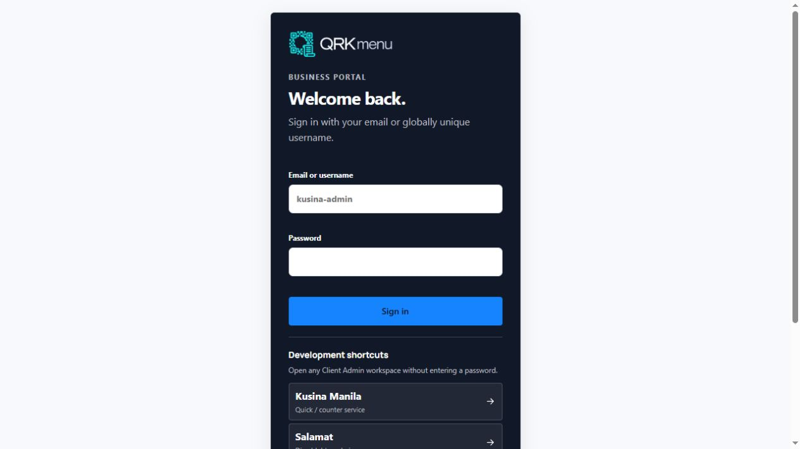
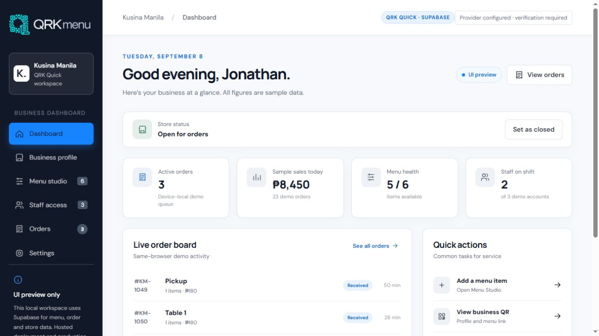
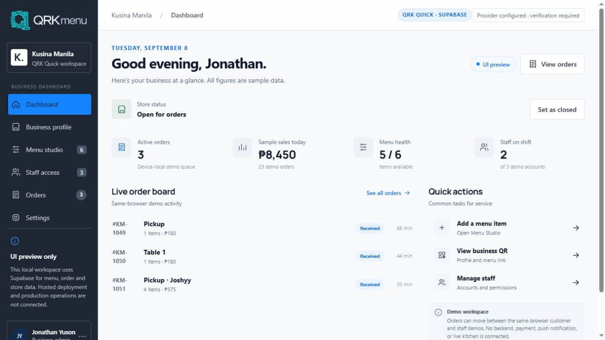
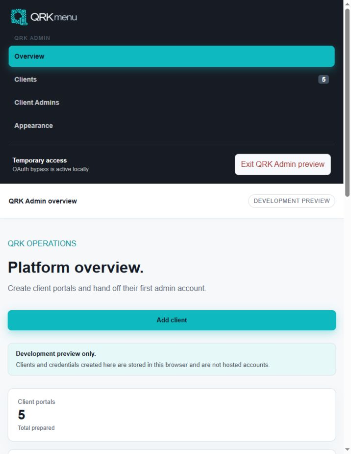
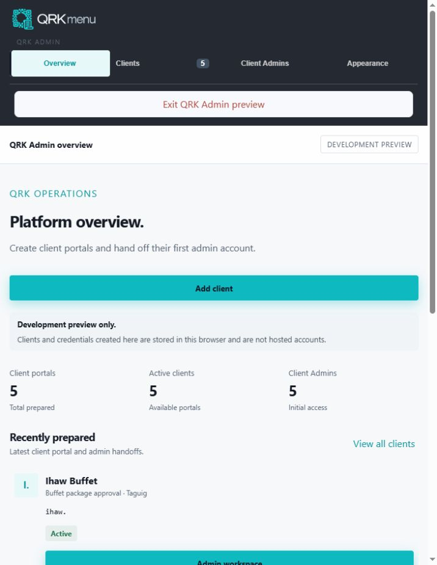
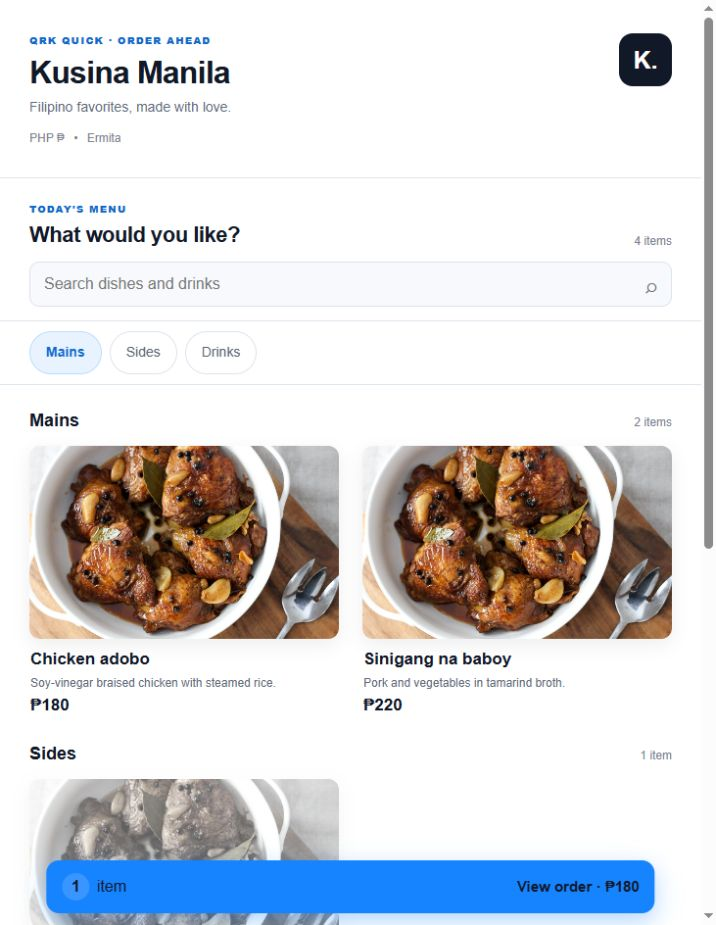
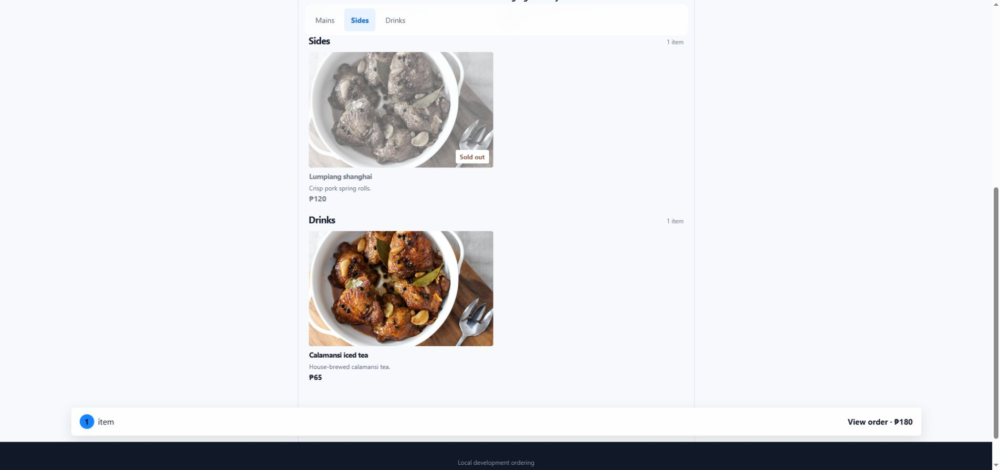

# Modern compact UI comparison

Captured locally on branch `codex/modern-compact-ui` on September 13, 2026. The concept preserves QRK brand assets and theme colors while changing typography and adopting a seamless material hierarchy: borderless content, quieter spacing, and selective glass-like navigation and floating controls.

## Business login

| Before | Modern compact |
| --- | --- |
|  |  |

## Kusina Manila dashboard

| Before | Modern compact |
| --- | --- |
|  |  |

## QRK Admin

| Before | Modern compact |
| --- | --- |
|  |  |

## Kusina Manila customer menu

| Before | Modern compact |
| --- | --- |
|  |  |

## Extended seamless review

- [Salamat Orders and Tables](after-orders-tables.png)
- [Salamat customer menu](after-menu-salamat.png)
- [Responsive Menu Studio](after-menu-studio.png)
